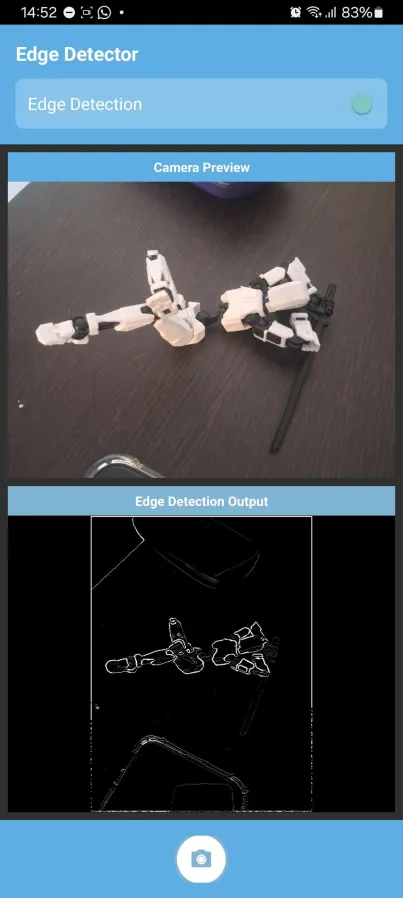
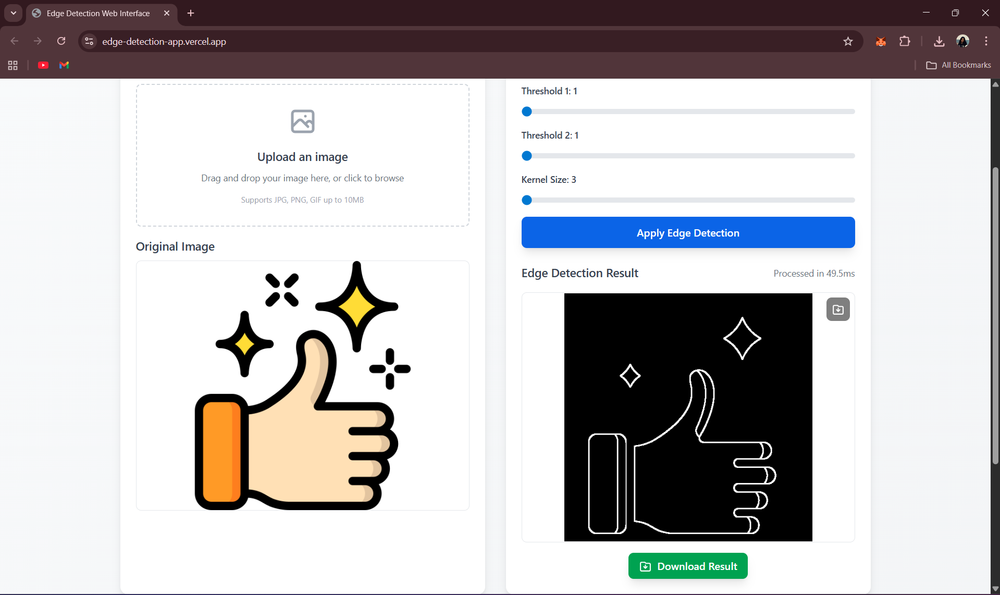

# Edge Detection App

A cross-platform app for real-time edge detection on Android and web, using OpenCV, C++, and modern web tech.

## Live Demo

- [Web App](https://edge-detection-app.vercel.app/)

### Android Demo Video

_Live demonstration of Android app edge detection capabilities - Click to watch on YouTube_

## Screenshots

- Android: 
- Web: 

## Features

**Android:**

- Real-time camera edge detection
- Native C++ (OpenCV) backend
- OpenGL rendering
- Toggle edge detection
- Performance optimized (3fps on 30fps camera)
- Camera permission handling
- **New:** Invert and Edge Enhancer filters

**Web:**

- Next.js + TypeScript
- Image upload & processing
- Real-time edge detection in browser
- Adjustable controls (threshold, kernel)
- Download results
- Responsive design
- **New:** Invert and Edge Enhancer filters

## Tech Stack

### Android App

- **Language**: Kotlin
- **Build System**: Gradle with Kotlin DSL
- **UI Framework**: Android Views with CameraX
- **Image Processing**: OpenCV 4.x
- **Native Code**: C++17 with CMake
- **Graphics**: OpenGL ES 2.0
- **Target SDK**: Android API 34 (Android 14)
- **Minimum SDK**: Android API 24 (Android 7.0)

### Web Application

- **Framework**: Next.js 14 (App Router)
- **Language**: TypeScript
- **Styling**: Tailwind CSS
- **Image Processing**: OpenCV.js
- **Build Tool**: npm/yarn

### Native Backend

- **Language**: C++17
- **Image Processing**: OpenCV
- **Graphics**: OpenGL ES, EGL
- **Build System**: CMake 3.22.1

## Project Structure

`app/` (Android), `opencv/` (OpenCV Android), `web-interface/` (Next.js web), `gradle/`, `build.gradle.kts` (root config)

## Quick Start

**Android:** Android Studio 2023.1+, SDK 34, NDK 25+, CMake 3.22.1+, OpenCV 4.x. Clone repo, open in Android Studio, import OpenCV, build & run.
**Web:** Node.js 18+, npm/yarn. `cd web-interface && npm install && npm run dev` (visit http://localhost:3000)

## Configuration

- Android: see `app/build.gradle.kts` and `CMakeLists.txt` (OpenCV 4.x, OpenGL ES 2.0, EGL, NDK)
- Web: see `web-interface/package.json` (Next.js 14, React 18, TypeScript 5, Tailwind CSS 3)

## Usage

- Android: Launch app, grant camera permission, start camera, toggle edge detection, try new filters (invert, edge enhancer)
- Web: Upload image, adjust controls, process, download result, try new filters (invert, edge enhancer)

## Architecture

- Android: Kotlin UI → CameraX → JNI → C++ (OpenCV, OpenGL) → Output
- Web: React (TS) → Upload → Edge Detection → Canvas → Download

## Edge Detection Algorithms

- Canny, Sobel, Gaussian blur, threshold adjustment
- **New:** Invert and Edge Enhancer filters
- Optimized: frame rate control, memory management, background/native processing

## Supported Platforms

- Android 7.0+ (API 24+), ARM64-v8a/ARMv7, camera required
- Web: Chrome 90+, Firefox 88+, Safari 14+, Edge 90+, desktop/mobile, JPEG/PNG/WebP

## Development

- Android: `./gradlew clean`, `./gradlew :app:assembleDebug`, `./gradlew :app:assembleRelease`
- Web: `npm run dev`, `npm run build`, `npm run start`
- Android tests: `./gradlew test` (unit), `./gradlew connectedAndroidTest` (instrumented)
- Web tests: `npm run lint`, `npx tsc --noEmit`
- Tested on real devices, emulators, API 24-34

## Contributing

- Fork, branch, commit, push, and open a PR
- Follow Kotlin/TypeScript conventions, add tests, update docs

## Acknowledgments

- OpenCV, CameraX, Next.js, Tailwind CSS

## Support

- For questions or issues: open a GitHub issue or check docs/comments
